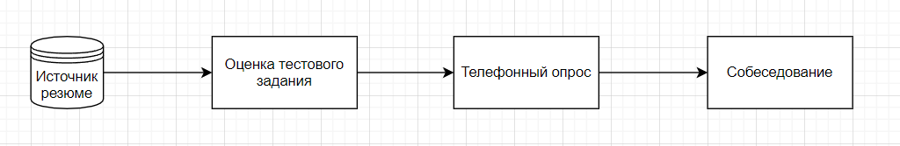

Не утихают споры в интернете кто такой сеньор, мидл, джун, стажёр. Здесь под словом джун имеется в виду, человек у которого есть:
-   уверенные теоретические знания языка программирования, в моём случае java.
-   минимальное владение фреймворком spring
-   git
- sql
  
    Текущий процесс

Как оценивать тестовое задание?

По субъективному опыту лучшие кандидаты имеют тестовое задание, сделанное в соответствии с заданием. Если написано, что нужно написать тесты, то тесты должны быть. Если написано мокировать внешние вызовы, то это должно быть реализовано. Вначале я закрывал глаза на некоторые невыполненные пункты, но это стало приводить к проблемам. Человек заваливал интервью спустя 15 минут и оказывалось, что тестовое это франкенштейн из кусков кода скопированных из интернета. Весь процесс собеседования это стресс и в большей степени для кандидата, так что в идеальном мире собеседование должно равняться найму. К счастью, с джунами имеется опция в виде тестового задания и телефонного опроса, стоит это использовать на сто процентов.

Телефонный опрос

Рекомендую проводить лично, так как это подарит вам прекрасные эмоции и воспоминания. Слышать, как гугляться ответы на ваши вопросы — бесценно. Вопросы должны быть простыми и ответы не должны предполагать большого выбора. Почему я предлагаю проводить их лично? Если кандидат гуглит ответы или вы чётко понимаете, что человек не знает ответы на простые вопросы, то мучать человека собеседованием смысла нет.

Собеседование

По большой части смотрим на горящие глаза и желание учиться. Если получится наладить первые два этапа, то собеседование уже будет больше формальностью. С высоким процентом найма.

Призываю относиться к кандидатам, как к состоявшимся специалистам и ни в коем случае не позволять смотреть на них свысока. Что за очевидный пункт? К сожалению, я встречал такое на собственном опыте и хочу чтобы такого было меньше. Если хотите узнать истинное лицо компании, то посмотрите, как она обходится с джунами.

Джун — это специалист без опыта реальной работы. Мир тесен, возможно вы встретись с ним уже по другую сторону стола.